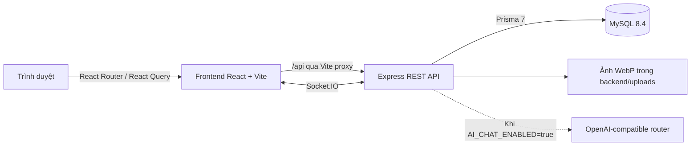

<p align="center">
  
</p>

<h1 align="center">May An</h1>

<p align="center">
  Nền tảng thương mại điện tử thời trang với cửa hàng trực tuyến, quản trị vận hành và hỗ trợ khách hàng theo thời gian thực.
</p>

<p align="center">
  <a href="https://nodejs.org/"></a>
  <a href="https://www.typescriptlang.org/"></a>
  <a href="https://react.dev/"></a>
  <a href="https://expressjs.com/"></a>
  <a href="https://www.mysql.com/"></a>
</p>

## Mục lục

- [Tổng quan](#tổng-quan)
- [Tính năng](#tính-năng)
- [Kiến trúc](#kiến-trúc)
- [Công nghệ](#công-nghệ)
- [Cấu trúc dự án](#cấu-trúc-dự-án)
- [Bắt đầu nhanh](#bắt-đầu-nhanh)
- [Cấu hình môi trường](#cấu-hình-môi-trường)
- [Các lệnh chính](#các-lệnh-chính)
- [Kiểm thử và an toàn dữ liệu](#kiểm-thử-và-an-toàn-dữ-liệu)
- [Bảo mật](#bảo-mật)
- [Tài liệu kỹ thuật](#tài-liệu-kỹ-thuật)
- [Xử lý sự cố](#xử-lý-sự-cố)
- [Đóng góp và hỗ trợ](#đóng-góp-và-hỗ-trợ)
- [Trạng thái và giấy phép](#trạng-thái-và-giấy-phép)

## Tổng quan

May An là ứng dụng bán hàng thời trang full-stack viết bằng TypeScript. Khách hàng có thể khám phá sản phẩm, quản lý giỏ hàng, đặt hàng COD và theo dõi đơn. Nhân viên quản trị vận hành danh mục, sản phẩm, tồn kho, đơn hàng, khách hàng, banner trang chủ và hàng đợi hỗ trợ trong cùng một hệ thống.

Dự án đang phục vụ môi trường phát triển cục bộ. Cấu hình thanh toán MoMo đã được đặt chỗ nhưng chưa đấu nối; không xem hệ thống hiện tại là bản sẵn sàng cho production.

## Tính năng

### Cửa hàng

- Trang chủ có carousel banner lấy từ database, tự động trượt và chỉ hiển thị banner đang bật.
- Danh sách sản phẩm hỗ trợ tìm kiếm, lọc, sắp xếp và phân trang.
- Chi tiết sản phẩm theo slug, ảnh, biến thể size/màu và tồn kho từng biến thể.
- Đăng ký, đăng nhập, cập nhật hồ sơ, ảnh đại diện và sổ địa chỉ.
- Giỏ hàng, thanh toán COD, lịch sử đơn và timeline trạng thái đơn.
- Khách hàng được huỷ đơn khi đơn còn ở trạng thái chờ xử lý.
- Trợ lý mua sắm AI tùy chọn; khách có thể chuyển cuộc hội thoại sang nhân viên hỗ trợ.

### Quản trị

- Dashboard tổng quan và khu vực riêng được bảo vệ theo vai trò `ADMIN`.
- Quản lý sản phẩm, ảnh, biến thể, danh mục và trạng thái bán.
- Quản lý tồn kho kèm lịch sử biến động và cơ chế phát hiện cập nhật đồng thời.
- Quản lý đơn hàng, trạng thái thanh toán và vòng đời giao hàng.
- Quản lý khách hàng, phân quyền và thu hồi phiên đăng nhập.
- Quản lý banner: tải ảnh, sửa nội dung, sắp xếp, thay ảnh và bật/tắt hiển thị.
- Tiếp nhận, phân công và trò chuyện trực tiếp với khách hàng qua Socket.IO.

## Kiến trúc



Frontend chuyển tiếp `/api`, `/socket.io` và `/uploads` tới backend trong môi trường phát triển. Cách này giữ request cùng origin ở phía trình duyệt và cho phép cookie xác thực hoạt động mà không cần đưa token vào JavaScript phía client.

## Công nghệ

| Lớp | Công nghệ chính |
|---|---|
| Frontend | React 19, React Router 7, TanStack Query 5, Vite 8, Tailwind CSS 4 |
| Backend | Node.js 20+, Express 5, TypeScript, Zod, Socket.IO |
| Dữ liệu | MySQL 8.4, Prisma ORM 7, Prisma MariaDB adapter |
| Xác thực | JWT access/refresh, cookie `httpOnly`, bcryptjs |
| Xử lý ảnh | Multer, Sharp, lưu tệp cục bộ |
| Kiểm thử | Vitest, Supertest, TypeScript typecheck, OpenAPI contract check |

## Cấu trúc dự án

```text
project_ca_nhan/
├── backend/                 # Express API, Prisma schema, migration, seed và test
│   ├── prisma/
│   ├── src/
│   └── tests/
├── frontend/                # Ứng dụng React, API client và component validator
│   ├── public/
│   ├── scripts/
│   └── src/
├── docs/
│   ├── backend/             # OpenAPI, database runbook và backend contract
│   └── frontend/            # Frontend handoff và API contract
├── postman/                 # Tài nguyên kiểm thử API bằng Postman
├── DESIGN.md                # Hệ thống thiết kế giao diện
└── package.json             # Lệnh điều phối frontend và backend
```

## Bắt đầu nhanh

### Yêu cầu

- Node.js 20 trở lên và npm.
- MySQL 8.4 đang chạy. Có thể dùng MySQL do Laragon cung cấp trên Windows.
- Git nếu cài đặt từ kho nguồn.

### 1. Lấy mã nguồn và cài thư viện

```powershell
git clone https://github.com/tamdt131005/project_ca_nhan.git
cd project_ca_nhan
npm install
npm run setup
```

### 2. Tạo database phát triển và kiểm thử

Mở MySQL CLI rồi chạy:

```sql
CREATE DATABASE agentchuan_shop
  CHARACTER SET utf8mb4 COLLATE utf8mb4_unicode_ci;

CREATE DATABASE agentchuan_shop_test
  CHARACTER SET utf8mb4 COLLATE utf8mb4_unicode_ci;
```

Database test là vùng dữ liệu tạm và sẽ bị xoá sạch khi chạy test. Không dùng database này để lưu dữ liệu cần giữ lại.

### 3. Tạo cấu hình backend

```powershell
Copy-Item backend\.env.example backend\.env
```

Mở `backend/.env`, kiểm tra chuỗi kết nối database và thay hai JWT secret mẫu bằng chuỗi ngẫu nhiên. Có thể tạo secret bằng Node.js:

```powershell
node -e "console.log(require('crypto').randomBytes(48).toString('base64url'))"
```

### 4. Áp dụng migration và tạo dữ liệu mẫu

```powershell
cd backend
npx prisma migrate deploy
npm run seed
cd ..
```

Lệnh seed tạo hai tài khoản dùng trong môi trường phát triển:

| Vai trò | Email | Mật khẩu |
|---|---|---|
| Quản trị viên | `admin@shop.test` | `Admin@12345` |
| Khách hàng | `khach@shop.test` | `Khach@12345` |

Không sử dụng các thông tin đăng nhập mẫu này trong môi trường công khai.

### 5. Chạy ứng dụng

```powershell
npm run dev
```

| Dịch vụ | Địa chỉ |
|---|---|
| Cửa hàng | <http://localhost:5173> |
| Danh sách sản phẩm | <http://localhost:5173/san-pham> |
| Trang quản trị | <http://localhost:5173/admin> |
| Backend health check | <http://localhost:4000/api/health> |

## Cấu hình môi trường

Nguồn cấu hình mẫu nằm tại [`backend/.env.example`](backend/.env.example). Các nhóm biến chính:

| Nhóm | Biến | Ghi chú |
|---|---|---|
| Database | `DATABASE_URL`, `TEST_DATABASE_URL` | Tách riêng dữ liệu phát triển và kiểm thử |
| Server | `NODE_ENV`, `PORT`, `CORS_ORIGIN` | Backend mặc định chạy ở cổng `4000` |
| JWT | `JWT_ACCESS_SECRET`, `JWT_REFRESH_SECRET`, TTL | Secret chỉ nằm ở backend |
| Upload | `UPLOAD_DIR`, `MAX_UPLOAD_MB` | Ảnh được chuẩn hoá và lưu dưới thư mục upload |
| Đơn hàng | `SHIPPING_FEE` | Giá trị nguyên theo VND |
| AI chat | `AI_CHAT_ENABLED`, `CUSTOM_AI_*`, `AI_CHAT_*` | Mặc định tắt; API key không được đưa sang frontend |
| MoMo | `MOMO_*` | Chưa đấu nối, có thể để trống khi phát triển |

Không commit `backend/.env` hoặc khóa bí mật vào Git.

## Các lệnh chính

Chạy từ thư mục gốc nếu không có ghi chú khác:

| Lệnh | Mục đích |
|---|---|
| `npm run dev` | Chạy backend và frontend đồng thời |
| `npm run dev:backend` | Chỉ chạy Express API |
| `npm run dev:frontend` | Chỉ chạy Vite frontend |
| `npm run build` | Build cả backend và frontend |
| `npm run typecheck` | Kiểm tra kiểu TypeScript toàn dự án |
| `npm test` | Chạy test backend bằng Vitest và Supertest |
| `npm run setup` | Cài thư viện riêng cho backend và frontend |
| `npm --prefix frontend run api:check` | Kiểm tra OpenAPI contract và ranh giới admin API |
| `npm --prefix frontend run validate:components` | Kiểm tra quy ước component frontend |
| `npm --prefix backend run studio` | Mở Prisma Studio |

Sau khi build, chạy backend đã biên dịch bằng `npm --prefix backend start`.

## Kiểm thử và an toàn dữ liệu

> [!CAUTION]
> `npm test` xoá toàn bộ dữ liệu trong database test trước mỗi test. Chỉ chạy khi `TEST_DATABASE_URL` trỏ chính xác tới `agentchuan_shop_test`.

Bộ test có hai chốt chặn độc lập. Test dừng trước khi reset nếu URL không phải MySQL hợp lệ hoặc tên database không khớp chính xác `agentchuan_shop_test`. Không đổi chốt chặn để chạy test trên database phát triển hay production.

Kiểm tra tập trung trước khi gửi thay đổi:

```powershell
npm run typecheck
npm run build
npm --prefix frontend run api:check
npm --prefix frontend run validate:components
npm test
```

Test cần MySQL và database test đã được tạo. Các lệnh typecheck, build và kiểm tra contract không thay thế kiểm thử tích hợp database.

## Bảo mật

- Mật khẩu được băm bằng bcrypt; API không trả `passwordHash`.
- Access token và refresh token được gửi qua cookie `httpOnly`; refresh token được băm bằng HMAC-SHA-256 có khóa trước khi lưu vào database và được xoay vòng.
- Route quản trị kiểm tra quyền ở backend, không dựa vào việc ẩn giao diện frontend.
- API có rate limit; upload ảnh kiểm tra dung lượng và xử lý lại bằng Sharp.
- `TRUST_PROXY` mặc định là `0`. Chỉ thay đổi khi đã xác định đúng số tầng proxy tin cậy.
- Khóa AI và cấu hình thanh toán chỉ thuộc backend.

Các kiểm soát này không thay thế đánh giá bảo mật và cấu hình hạ tầng trước khi triển khai công khai.

## Tài liệu kỹ thuật

- [Hệ thống thiết kế](DESIGN.md)
- [Backend contract](docs/backend/README.md)
- [OpenAPI specification](docs/backend/openapi.yaml)
- [Database runbook](docs/backend/database.md)
- [Frontend API contract](docs/frontend/FE002-API-CONTRACT.md)
- [Frontend handoff](docs/frontend/HANDOFF.md)

Cấu trúc README tham khảo [hướng dẫn README chính thức của GitHub](https://docs.github.com/en/repositories/managing-your-repositorys-settings-and-features/customizing-your-repository/about-readmes) và [Standard Readme](https://github.com/RichardLitt/standard-readme). Tài liệu này không tuyên bố tuân thủ đầy đủ một tiêu chuẩn chứng nhận.

## Xử lý sự cố

| Triệu chứng | Cách kiểm tra |
|---|---|
| `P1001: Can't reach database server` | Bật MySQL và kiểm tra host/cổng trong `DATABASE_URL` |
| `P1000: Authentication failed` | Kiểm tra user và mật khẩu MySQL trong `backend/.env` |
| `P1003: Database does not exist` | Tạo đúng hai database rồi chạy migration |
| Đăng nhập xong lại mất phiên | Truy cập qua frontend cổng `5173`; không gọi API cổng `4000` trực tiếp từ trình duyệt |
| Health check trả `503` | Backend chạy nhưng không kết nối được database |
| API trả `429 RATE_LIMITED` | Chờ hết cửa sổ giới hạn; không vô hiệu hoá rate limit để che lỗi client |
| AI không phản hồi | Kiểm tra `AI_CHAT_ENABLED`, router tương thích OpenAI, model và API key ở backend |
| Ảnh upload không hiển thị | Kiểm tra `UPLOAD_DIR`, quyền ghi và proxy `/uploads` của Vite |

## Đóng góp và hỗ trợ

1. Tạo branch riêng cho thay đổi.
2. Giữ thay đổi đúng phạm vi và cập nhật tài liệu liên quan.
3. Chạy các kiểm tra phù hợp trong phần [Kiểm thử và an toàn dữ liệu](#kiểm-thử-và-an-toàn-dữ-liệu).
4. Gửi pull request kèm mô tả hành vi thay đổi và bằng chứng kiểm tra.

Báo lỗi và đề xuất tại [GitHub Issues](https://github.com/tamdt131005/project_ca_nhan/issues). Chủ dự án và người duy trì hiện tại: [Tâm Đặng](https://github.com/tamdt131005).

## Trạng thái và giấy phép

Dự án hiện được cấu hình cho môi trường phát triển cục bộ và chưa được xác nhận sẵn sàng cho production. Kho mã hiện chưa có tệp `LICENSE`; chưa có giấy phép nguồn mở nào được cấp kèm dự án.
